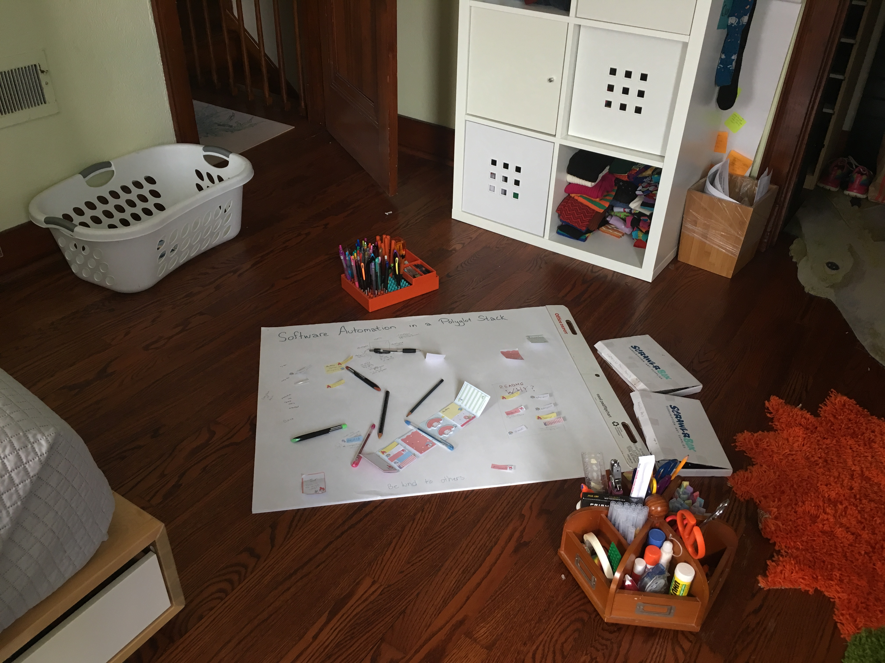
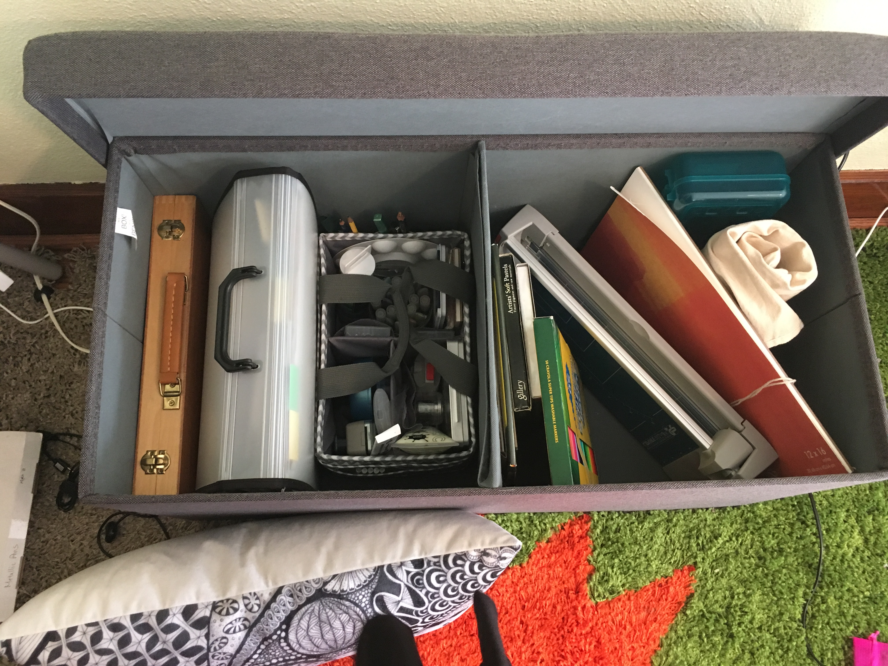
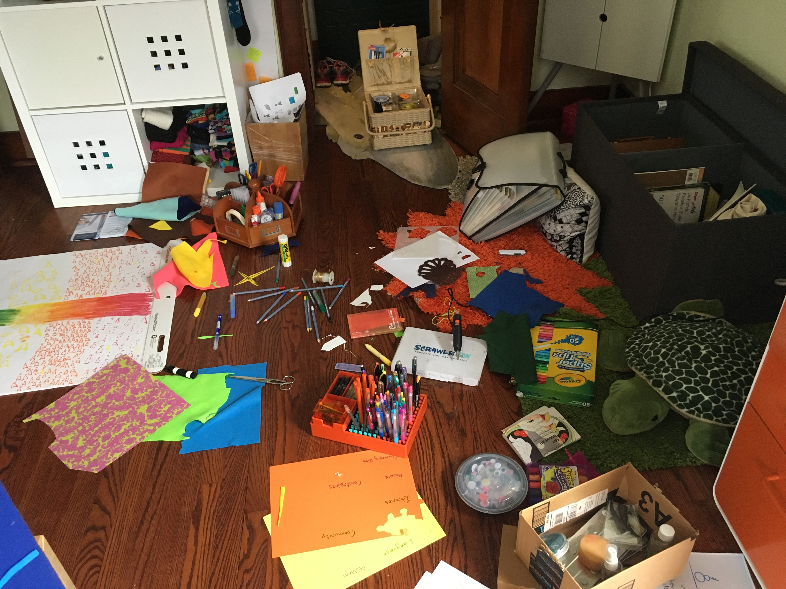

Our job is exploration.

What are we exploring? The business domain, that's the objective.

We must also explore our own domain: software development.
When we make something that we do easy, when we create a new current, then we can explore further.

## Polyglot

In this talk, I used several different diagramming and presentation mediums.
It helped me explore the topic, see.

This is the my room the first day I worked on my talk:

My existing tools weren't enough, so I went exploring at the craft store, and
came back with lots of felt. I even bought a new 
organizer; the more tools we have, the more tools we need to maintain them.

On Monday, my room looked like this:

It's OK that it's disorganized.
It's OK that I used whatever inspired me at the moment, because this presentation is done.
Like most art, there is a finished state. This is not the case with most software.
We need to come back to it. We need to change it. And other people, too, not just me.
To fix and change it, we need to understand the tools it was created in.
That can be asking a lot of future-you and future-other-people, after the knowledge is out of your head.

It is a commitment, then, to introduce a new programming language into mission-critical software (production, or operational tools that enable production).
Be prepared to parent this code, or throw it away.

A choice of language system is about who we want to work with. The community, and within our organization. Make a clean API, and then use automation to make the right things easy, welcoming other people into collaboration.
keep the workspace clean and welcoming.
 
